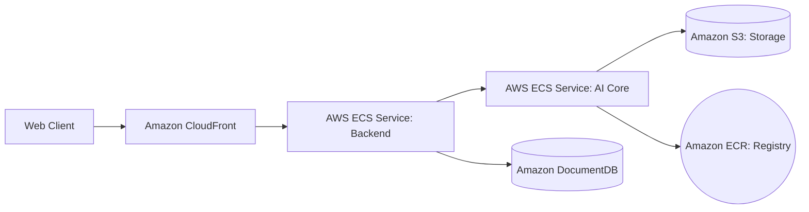

# 🌌 AuroraAI: Multi-Modal Intelligent Ecosystem

AuroraAI is a premium, enterprise-grade AI platform designed for high-performance content synthesis, document intelligence, and universal conversational AI. Built with a modular microservice architecture, it combines a stunning React-based glassmorphism UI with a dual-layer AI core powered by local LLMs and cloud-based models.

---

## ✨ Key Capabilities

### 🎨 Content Studio
A generative suite for creators. Synthesize high-fidelity assets across multiple modes:
- **Text**: Blogs, emails, and social hooks with specific tones (Creative, Funny, Epic, Sarcastic).
- **Visuals**: AI-generated imagery and Anime art.
- **Media**: Short video concepts and voiceover scripts.

### 🧠 Document Intelligence
Advanced RAG (Retrieval Augmented Generation) pipeline for deep data analysis:
- **Vectorization**: Transform PDFs, Docx, and TXTs into semantic embeddings.
- **Auto-Summarization**: Instant core synthesis of massive document volumes.
- **Semantic Indexing**: Context-aware querying of your internal knowledge cluster.

### 💬 Aether Chat
A universal AI assistant for natural language interaction:
- Secure, local-first processing for private data.
- Context-aware responses utilizing both global knowledge and your uploaded documents.

---

## 🛠️ Technology Stack

- **Frontend**: React (Vite), Tailwind CSS v4, Framer Motion, Lucide React.
- **Backend**: Node.js (Express), Multer (File Ingestion), Mongoose.
- **AI Core**: Python (FastAPI), FAISS (Vector DB), Sentence-Transformers, PyPDF.
- **Database**: MongoDB (Activity & Analytics Ledger).
- **Cloud Storage**: Amazon S3 (Object Storage for media & document clusters).
- **Registry & CI/CD**: Amazon ECR (Elastic Container Registry).
- **AI Providers**: Ollama (Local), Google Gemini 2.5, Groq (Llama-3), Stability AI.

---

## 🚀 Quick Start (Docker)

The fastest way to launch the entire ecosystem is using **Docker Compose**.

1. **Clone & Configure**:
   ```bash
   cp .env.example .env
   # Edit .env with your API keys (optional but recommended for cloud models)
   ```

2. **Launch Ecosystem**:
   ```bash
   docker compose up --build
   ```

3. **Access Services**:
   - **Main UI**: [http://localhost:3000](http://localhost:3000)
   - **API Gateway**: [http://localhost:5000/api](http://localhost:5000/api)
   - **AI Core**: [http://localhost:8000](http://localhost:8000)

---

## 🔧 Manual Setup (Scratch)

If you prefer to run services individually for development:

### 1. Prerequisites
- **Node.js** (v18+)
- **Python** (3.10+)
- **Ollama** (Running locally on port 11434)
- **MongoDB** (Running on port 27017)

### 2. AI Core (Python)
```bash
cd ai-service
python -m venv venv
source venv/bin/activate  # Windows: venv\Scripts\activate
pip install -r requirements.txt
python main.py
```

### 3. Backend Gateway (Node.js)
```bash
cd backend
npm install
npm run dev
```

### 4. User Interface (React)
```bash
cd frontend
npm install
npm run dev
```

---

## ☁️ Cloud Infrastructure (AWS)

AuroraAI is architected for seamless cloud scalability, utilizing Amazon Web Services (AWS) for production environments:

### 📦 Media & Document Storage (Amazon S3)
Generated assets, anime art, and uploaded knowledge documents are transitioned to **Amazon S3** in production. This ensures:
- **Global Availability**: Content is served via low-latency endpoints.
- **Durability**: 99.999999999% durability for enterprise knowledge clusters.
- **Scalability**: Handles petabytes of training and synthesis data without performance degradation.

### 🐳 Container Orchestration (Amazon ECR)
The microservice ecosystem is containerized and hosted on **Amazon Elastic Container Registry (ECR)**:
- **Private Registry**: Secure storage and management of the Frontend, Backend, and AI-Service images.
- **Vulnerability Scanning**: Automated security audits for all OS-level dependencies.
- **Seamless Deployment**: Integrated with AWS deployment pipelines (ECS/EKS) for zero-downtime updates.

### 🏗️ Production Architecture


---

## ⚙️ Configuration (.env)

| Variable | Description | Default |
| :--- | :--- | :--- |
| `GEMINI_API_KEY` | Google AI Studio key | Optional |
| `GROQ_API_KEY` | Groq platform key | Optional |
| `OLLAMA_HOST` | Local Ollama endpoint | `http://localhost:11434` |
| `STABILITY_API_KEY` | Stability AI key for high-res images | Optional |
| `AWS_ACCESS_KEY_ID`| AWS User Key | Required for S3 |
| `AWS_SECRET_ACCESS_KEY`| AWS User Secret | Required for S3 |
| `AWS_S3_BUCKET` | S3 Bucket Name | Required for S3 |
| `AWS_REGION` | AWS Region (e.g. us-east-1) | `us-east-1` |

---

## 📡 Port Mappings

| Port | service | Access |
| :--- | :--- | :--- |
| **3000** | Frontend | Web Application UI |
| **5000** | Backend | REST API Infrastructure |
| **8000** | AI Service | LLM Processing Engine |
| **27017**| MongoDB | Data Storage Layer |

---

## 🆘 Troubleshooting

- **AI Service startup error**: Ensure `main.py` is in the root of `ai-service/` and you are using the correct uvicorn command (`uvicorn main:app`).
- **MongoDB Connection**: If running manually, ensure a local MongoDB instance is active on port 27017.
- **Ollama Offline**: If the UI shows "Neural Engine Offline", check that `ollama serve` is running in the background.

---

## 📝 License
MIT License. Built for the future of decentralized AI.
